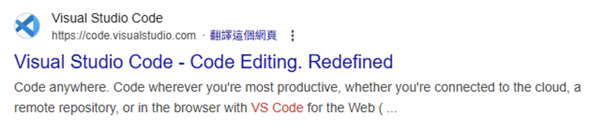
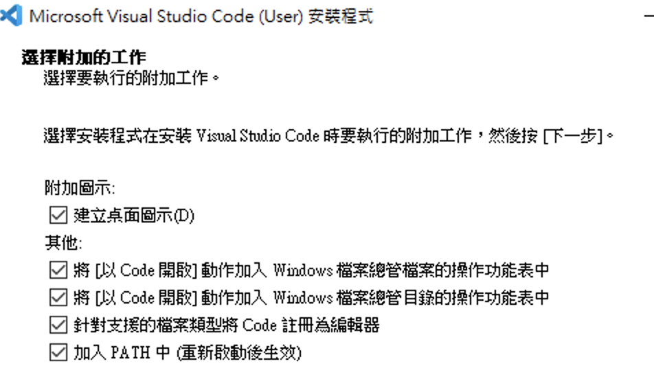

# VS Code 安裝

### 第一步：下載 VS Code

Windows 有2種方法，

1. 從 Microsoft Store 搜尋 vscode 進行安裝。

2. 利用 Google 搜尋 vscode 後，找出像下面的連結。

     

3. 進入網站後，選擇 "Download for Windows" 即可下載。(注意 Windows 防毒問題)

### 第二步：執行安裝程式

下載完成後，你會得到一個名為 `VSCodeUserSetup-{version}.exe` 的檔案。點擊兩下執行它，並按照以下步驟完成安裝。

1. **同意授權條款**： 閱讀授權條款後，選擇「我同意此協議」，然後點擊「下一步」。

2. **選擇安裝路徑**： 你可以使用預設的安裝路徑，或者點擊「瀏覽」來選擇你想要安裝的位置。一般建議保留預設值即可。點擊「下一步」。

3. **選取開始功能表資料夾**： 這裡也不需要做特別的修改，直接點擊「下一步」。

4. **選取附加工作 (重要！)**： 這個步驟會影響你未來使用 VS Code 的便利性，請務必根據你的需求勾選。(建議全選，如圖)
   
     
   - **在桌面建立捷徑**：勾選後會在桌面建立一個啟動 VS Code 的捷徑。
   
   - **將 "Open with Code" 操作新增至 Windows 檔案總管的檔案右鍵功能表**：強烈建議勾選！這讓你可以對任何檔案點擊右鍵，直接用 VS Code 開啟。
   
   - **將 "Open with Code" 操作新增至 Windows 檔案總管的目錄右鍵功能表**：強烈建議勾選！這讓你可以對任何資料夾點擊右鍵，直接用 VS Code 開啟整個專案。
   
   - **將 Code 註冊為受支援檔案類型的編輯器**：建議勾選，讓 VS Code 成為你預設的程式碼編輯器。
   
   - **新增到 PATH (登出後生效)**：**務必勾選！** 這是最重要的選項。勾選後，你才能在命令提示字元 (CMD) 或 PowerShell 中，透過輸入 `code` 指令來啟動 VS Code。
   
5. **準備安裝**： 確認你的設定無誤後，點擊「安裝」。

6. **完成安裝**： 安裝過程很快就會完成。完成後，可以勾選「啟動 Visual Studio Code」，然後點擊「完成」。

### 第三步：初次啟動與基本設定

恭喜你！VS Code 已經成功安裝在你的電腦上了。第一次啟動時，你會看到歡迎畫面，接下來我們進行一些基礎設定，讓開發體驗更順暢。

1. **中文化 (選擇性，英文尚可不建議)**： VS Code 預設是英文介面。如果你偏好中文介面，可以輕鬆安裝語言套件。
   - 點擊左側活動列 (Activity Bar) 最下方的「擴充套件」(Extensions) 圖示，或使用快捷鍵 `Ctrl+Shift+X`。
   - 在搜尋框中輸入 `Chinese (Traditional) Language Pack`。
   - 找到由 Microsoft 官方發行的「繁體中文語言套件」，點擊「Install」。
   - 安裝完成後，右下角會跳出提示，點擊「Change Language and Restart」，VS Code 就會重啟並切換為中文介面。
2. **選擇顏色主題**： 一個賞心悅目的介面可以讓你寫程式的心情更好。
   - 使用快捷鍵 `Ctrl+K Ctrl+T` 或點擊左下角的齒輪圖示，選擇「顏色主題」。
   - 你可以即時預覽並選擇內建的多種主題 (如 Dark+, Light+)。
   - 你也可以在擴充套件市集中搜尋 `Theme`，安裝更多社群開發的熱門主題，例如 `One Dark Pro`、`Dracula Official` 等。
3. **認識使用者介面**： 花一點時間熟悉 VS Code 的主要介面區域：
   - **活動列 (Activity Bar)**：最左側，用於切換不同的檢視，如檔案總管、搜尋、原始檔控制、擴充套件等。
   - **側邊欄 (Side Bar)**：顯示活動列中所選檢視的詳細內容。
   - **編輯器 (Editor)**：你的主要工作區域，用於撰寫和編輯程式碼。
   - **面板 (Panel)**：下方區域，預設包含終端機 (Terminal)、問題 (Problems)、輸出 (Output) 等。可使用 `Ctrl+` `(反引號) 快速開關。
   - **狀態列 (Status Bar)**：最下方，顯示目前檔案的資訊、Git 分支、錯誤和警告等。

### 第四步：安裝必備擴充套件

VS Code 的強大之處在於其擴充套件。以下推薦幾款幾乎是所有開發者都會安裝的實用工具。

1. **Prettier - Code formatter**:
   - **功能**：自動格式化你的程式碼，統一程式碼風格，支援多種語言。告別手動排版的痛苦。
   - **設定教學**：安裝後，按下 `Ctrl+Shift+P` 開啟命令選擇區，搜尋 `settings` 並開啟 `喜好設定: 開啟設定 (UI)`。搜尋 `Format On Save` 並勾選，這樣每次存檔時就會自動幫你排版。
4. **Material Icon Theme**:
   - **功能**：讓你的檔案總管中的檔案和資料夾圖示變得更加美觀且易於識別。它會根據檔案類型和名稱顯示對應的圖示。

