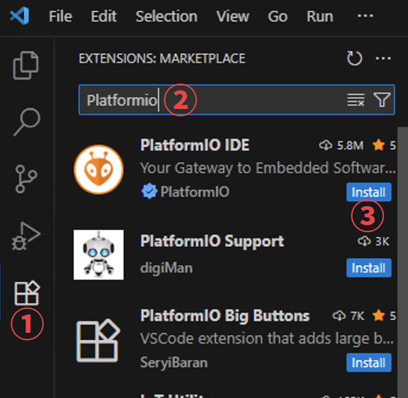
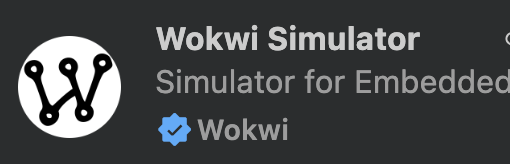
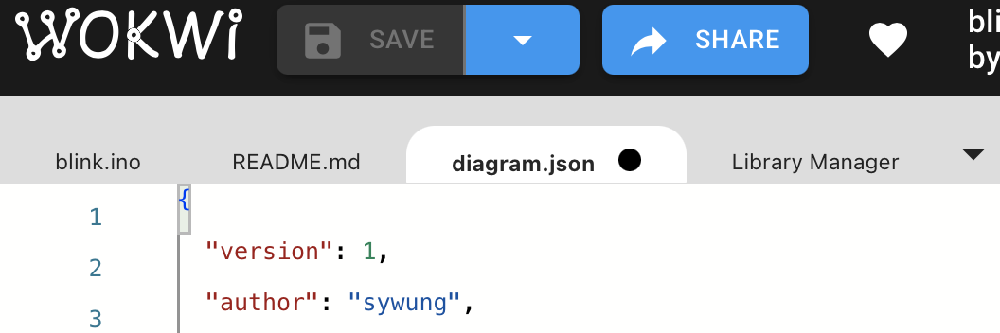
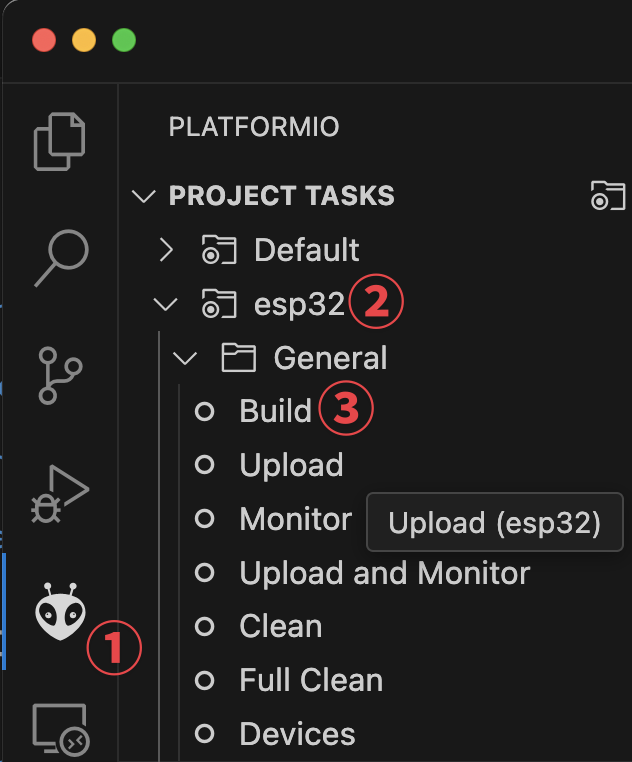
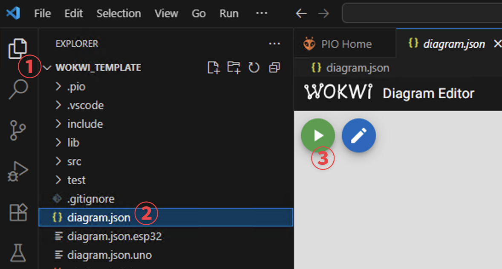

# Arduino/ESP32 開發與模擬環境設定

## 1. 安裝 VS Code

-    [請參考](https://github.com/sywung/saihs1141/blob/main/docs/vscode安裝.md)

------------------------------------------------------------------------

## 2. 安裝 VS Code 擴充套件

開啟 VS Code 後，請到左邊選單「方塊圖示」Extensions，搜尋並安裝： 



- **PlatformIO IDE**（用來編譯程式）

  

- **Wokwi Simulator**（用來模擬電路）

  

------------------------------------------------------------------------

## 3. 電路設計

1.  打開 [Wokwi 網站](https://wokwi.com) 畫電路圖。

2.  完成後，切換到上方的 **diagram.toml** 分頁。

3.  把裡面的文字全選、複製。

    

4.  貼到專案目錄中的 **diagram.json.xxx** 檔案（對應不同板子）。

------------------------------------------------------------------------

## 4. 程式設計

-   程式進入點一定要放在 `src/main.ino`
-   這個檔案裡面必須有：

``` cpp
void setup() {
  // 初始化程式
}

void loop() {
  // 主程式循環
}
```

------------------------------------------------------------------------

## 5. 選擇開發板

專案中已經有兩組設定檔，分別對應 **UNO** 和 **ESP32**。

-   UNO → `diagram.json.uno` + `wokwi.toml.uno`
-   ESP32 → `diagram.json.esp32` + `wokwi.toml.esp32`

切換板子時，只要執行以下指令：

### UNO

``` powershell
copy diagram.json.uno diagram.json
copy wokwi.toml.uno wokwi.toml
```

### ESP32

``` powershell
copy diagram.json.esp32 diagram.json
copy wokwi.toml.esp32 wokwi.toml
```

------------------------------------------------------------------------

## 6. 程式編譯

1.  點左邊 VS Code 的 **外星人圖示**（PlatformIO）。

2.  找到你選的開發板 (esp32 / uno)。

3.  展開 **General** → 點選 **Build**。

    

4.  如果顯示 **SUCCESS** ✅，代表程式正確，可以繼續下一步。

5.  如果出現錯誤 ❌，請修改程式直到正確。

------------------------------------------------------------------------

## 7. 開始模擬

1.  在 VS Code 的左邊檔案總管 (Explorer)

2.  點選 **diagram.json**。Wokwi 模擬畫面會自動打開。

3.  按上方的 **綠色 ▶ 按鈕** 開始模擬。

    

小提醒：
- 如果要改接線 → 回到「電路設計」重做一次即可。程式沒改的話，不用重新編譯。
- 第一次使用會跳出 **Wokwi License**，請依照指示操作即可。
